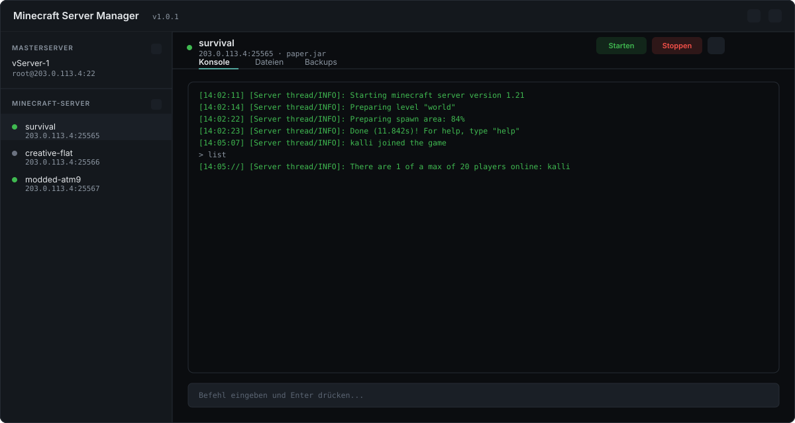
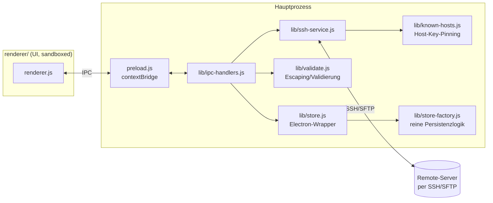

<div align="center">


# Minecraft Server Manager

**Electron-Desktop-App zur Remote-Verwaltung mehrerer Minecraft-Server per SSH.**

[](https://github.com/kallifabio/MinecraftServerControl/actions/workflows/ci.yml)


</div>

<br>



<br>

## Inhalt

- [Funktionen](#-funktionen)
- [Setup](#-setup)
- [Server-Software (Jars)](#-server-software-jars)
- [Zugangsdaten & Verschlüsselung](#-zugangsdaten--verschlüsselung)
- [SSH-Host-Key-Pinning](#-ssh-host-key-pinning)
- [Architektur](#️-architektur)
- [Auto-Update](#-auto-update)
- [Bekannte Einschränkungen](#️-bekannte-einschränkungen)

## ✨ Funktionen

| Bereich | Was es tut |
|---|---|
| 🔧 **Masterserver** | Mehrere Remote-Hosts (per SSH) anlegen, bearbeiten, löschen |
| 🚀 **Minecraft-Server** | Erstellen, starten, stoppen, löschen – mit Online/Offline-Status in der Liste |
| 📂 **Dateibrowser** | Ordner-Navigation mit Breadcrumbs, Upload per Drag & Drop, Download/Umbenennen/Löschen einzelner Dateien |
| 💾 **Backups** | `.tar.gz` des Serververzeichnisses erstellen, auflisten, herunterladen, löschen |
| 🖥️ **Live-Konsole** | Log-Streaming per `tail -f` über SSH, Befehle direkt an den laufenden Server senden |
| 🔑 **Sicherheit** | Verschlüsselte Zugangsdaten, SSH-Host-Key-Pinning, validierte/escapte Shell-Kommandos |

**Für wen:** Server-Admins mit mehreren Minecraft-Instanzen, Community-Leiter mit eigener Infrastruktur, Entwickler, die Server schnell aufsetzen wollen.

## 🚀 Setup

Voraussetzungen: [Node.js](https://nodejs.org/) (LTS) und npm.

```bash
npm install
npm start
```

Tests und Linter:

```bash
npm test
npm run lint
```

Baut ein Windows-Installer-Paket (NSIS) nach `dist/`:

```bash
npm run build
```

## 🧩 Server-Software (Jars)

Die App verwaltet Server-Jars (Paper, Spigot, BungeeCord, …) lokal unter
dem Anwendungsdatenordner (`%APPDATA%/Minecraft Server Manager/jars`).
Beim ersten Start werden eventuell im lokalen `jars/`-Ordner vorhandene
`.jar`-Dateien einmalig dorthin übernommen; darüber hinaus lassen sich
weitere Jars direkt über "Server Software hinzufügen" in der App hochladen.

> **Lizenzhinweis:** Server-Jars von Drittanbietern (Paper, Spigot,
> BungeeCord, …) unterliegen eigenen Lizenzbedingungen. Sie werden bewusst
> nicht im Git-Repository versioniert (siehe `.gitignore`) – bitte die
> jeweiligen Lizenzen der Projekte prüfen, bevor Jars weitergegeben werden.

## 🔐 Zugangsdaten & Verschlüsselung

Server- und Masterserver-Zugangsdaten (SSH-Passwörter) werden lokal unter
`%APPDATA%/Minecraft Server Manager/data/*.json` gespeichert. Passwörter
werden dabei über Electrons `safeStorage`-API (unter Windows: DPAPI, an
den aktuellen Windows-Benutzer gebunden) verschlüsselt abgelegt.

Ein Minecraft-Server speichert selbst **keine** Zugangsdaten mehr – er
referenziert nur die `id` seines Masterservers (`masterServerId`), die
tatsächlichen Zugangsdaten werden bei jeder Aktion frisch vom Masterserver-
Eintrag gelesen. Ändert sich dort das Passwort, funktionieren bestehende
Server-Einträge also weiterhin.

> **Diese Dateien enthalten sensible Daten und dürfen niemals versioniert
> oder geteilt werden.**

## 🔑 SSH-Host-Key-Pinning

Beim ersten Verbindungsaufbau zu einem Host wird dessen SSH-Host-Key-
Fingerabdruck (SHA-256) lokal gespeichert (Trust-on-first-use, analog zu
`~/.ssh/known_hosts`). Ändert sich der Fingerabdruck bei einem späteren
Connect unerwartet, wird die Verbindung abgelehnt (Schutz vor
Man-in-the-Middle-Angriffen). Nach einer *legitimen* Neuinstallation eines
Servers kann der gespeicherte Key über den Schlüssel-Button beim jeweiligen
Masterserver zurückgesetzt werden.

## 🏗️ Architektur



| Datei | Zweck |
|---|---|
| `main.js` | App-Bootstrap (Fenster, globale Shortcuts, Auto-Update-Check) |
| `preload.js` | Context-Bridge-API für den Renderer |
| `lib/store-factory.js` | reine Persistenzlogik (ohne Electron-Abhängigkeit, unit-testbar) |
| `lib/store.js` | verdrahtet die Factory mit echten Electron-Pfaden/`safeStorage` |
| `lib/ssh-service.js` | SSH/SFTP-Hilfsfunktionen inkl. Host-Key-Prüfung |
| `lib/known-hosts.js` | Trust-on-first-use-Host-Key-Speicher |
| `lib/validate.js` | Eingabevalidierung & sicheres Shell-Quoting |
| `lib/ipc-handlers.js` | IPC-Handler, die Renderer-Aktionen auf obige Module abbilden |
| `renderer/` | UI (HTML/JS, Tailwind via CDN, strikte CSP) |
| `test/` | `node:test`-Unit-Tests für Validierung, Persistenz, Host-Key-Pinning |
| `.github/workflows/ci.yml` | GitHub Actions: Lint + Tests bei jedem Push/PR |

## 🔄 Auto-Update

`electron-updater` ist verdrahtet (stiller Check beim Start, nur im
gepackten Build aktiv) und `package.json` verweist unter `build.publish`
auf GitHub Releases dieses Repos. Damit Auto-Update tatsächlich greift,
muss zusätzlich ein signiertes Release dort veröffentlicht werden
(`electron-builder --publish always` mit gültigem `GH_TOKEN`) – das ist
bewusst nicht Teil dieses Commits.

## ⚠️ Bekannte Einschränkungen

- Remote-Server werden aktuell als `root` unter `/root/<servername>`
  betrieben. Für produktive Umgebungen wird empfohlen, stattdessen einen
  dedizierten, unprivilegierten Systembenutzer zu verwenden.
- Es findet aktuell kein SSH-Verbindungs-Pooling statt – jede Aktion baut
  eine neue Verbindung auf.
- Der Online/Offline-Status in der Serverliste wird beim Laden einmalig
  geprüft, nicht laufend aktualisiert (kein automatisches Polling, um nicht
  unnötig viele SSH-Verbindungen zu allen Hosts offen zu halten).
- Es ist noch keine `LICENSE`-Datei hinterlegt.
